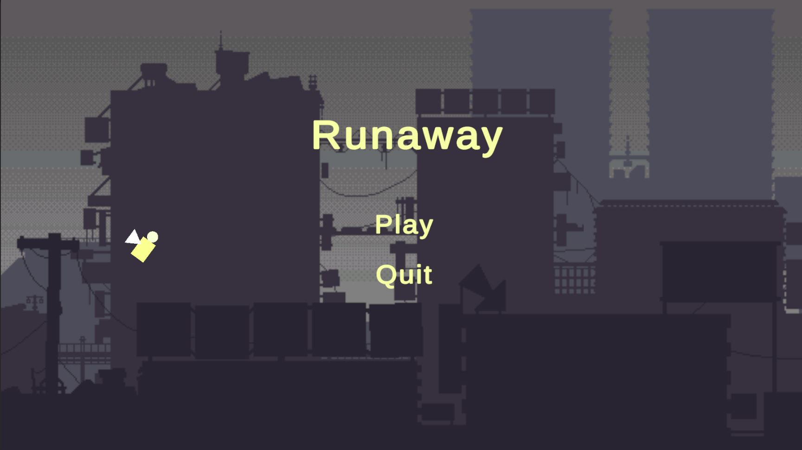

# Runaway

Runaway is a simple, addictive game inspired by the classic Flappy Bird. The goal is to guide your character through obstacles, achieving the highest possible score. This project is open for improvements and future features—feel free to contribute ideas and code!

## Features so far

- Classic tap-to-fly/flap gameplay

## Planned Features
- Dynamic obstacle generation
- Score tracking system
- Smooth animations
- Leaderboard for high scores
- Power-ups and collectibles
- Multiple characters/skins
- Sound effects and music
- Mobile and desktop compatibility
- Achievements and rewards

## Screenshot

## How to Play

- Tap or click to make your character flap/fly.
- Avoid hitting the obstacles.
- Survive as long as possible to increase your score.

## Contact

Created by [xTaig4](https://github.com/xTaig4).  
Feel free to reach out with questions, suggestions, or feedback!
